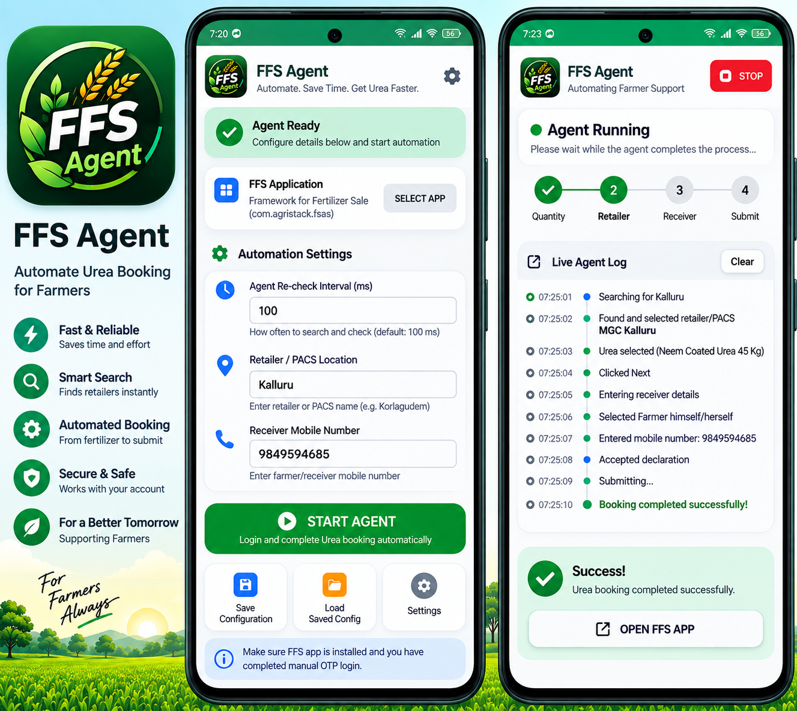
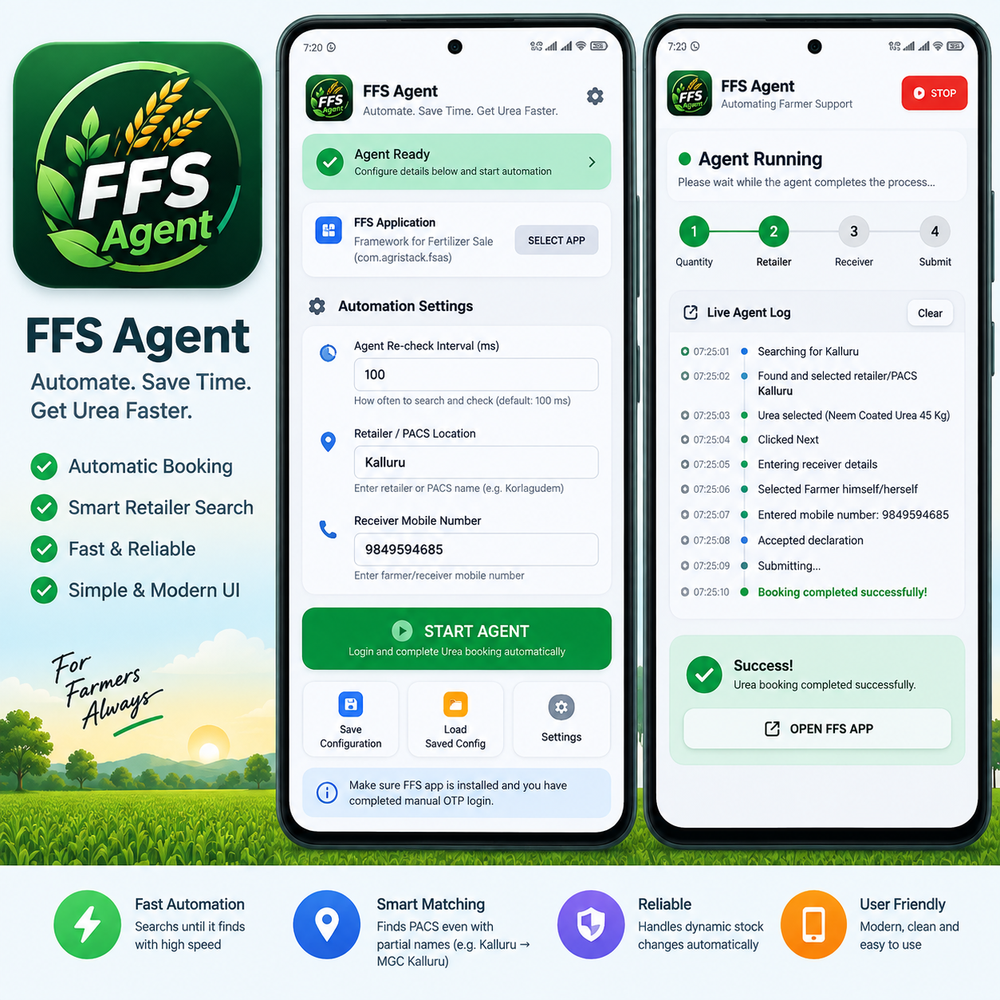
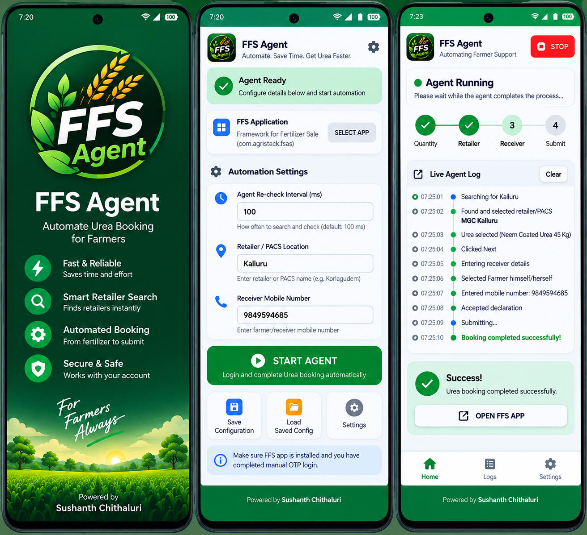

# FFS Agent

**FFS Agent** is an Android UI-automation application that helps a user complete a deterministic fertilizer-booking workflow inside the **Framework for Fertilizer Sale (FFS)** application.

The agent is designed around a fixed, human-defined workflow. It observes the target FFS application's accessibility UI, identifies the current step, performs the required action, verifies the resulting state, and continues until the booking is submitted successfully or the user stops the agent.

> **Important:** This project automates a third-party Android application's UI through Android `AccessibilityService`. It is not an API integration with the FFS backend. The OTP/login step remains manual.

---


## Service Lifecycle and Start/Stop Behavior

- Accessibility permission is enabled once by the user in Android Settings.
- The agent's Start/Stop choice is persisted locally, so closing the app from Recents does not intentionally reset the automation choice.
- The main **START AGENT** button acts as a toggle: it becomes **STOP AGENT** while automation is enabled.
- The app no longer displays a floating `FFS Agent — AGENT READY` accessibility overlay over other applications.
- Android/OEM software still controls the AccessibilityService lifecycle; aggressive battery-management settings may require the app to be exempted from battery optimization.

## UI Gallery

> The images below are project UI references/mockups used to explain the FFS Agent experience. They are intentionally kept separate from the automation engine documentation.

### FFS Agent — Configuration UI


The main screen lets the operator configure the target FFS application, retailer/PACS location, receiver mobile number, and automation polling interval. Configuration is automatically saved.

### FFS Agent — Automation Experience



The agent runs the workflow in the background while the live status/log area communicates the current operation and state.

### FFS Agent — Product/Workflow Showcase



This visual summarizes the intended product-selection and fertilizer-booking experience.

### UI Design Reference



This reference image was used during the UI refinement process.

---

## Important Operations at a Glance

| Operation | What the agent does | Verification / recovery |
|---|---|---|
| **Launch FFS** | Starts the selected FFS application after `START AGENT` | Waits for the FFS UI and manual login/OTP completion |
| **My Farm** | Navigates to My Farm | Uses visible UI text/state instead of blind fixed delays |
| **Verified Holdings** | Reads the verified land count | Uses that count as the exact number of individual land selections |
| **Land selection** | Selects individual land checkboxes | Avoids `Select All`; verifies the required count |
| **Recommended GFR** | Opens the GFR dialog and chooses **Recommended GFR Only** | Handles both accessibility-node and visible-text/gesture fallbacks |
| **Remove NPKS/DAP/MOP** | Presses the actual minus control until quantity reaches zero, then deletes | If minus is off-screen, performs at most two small scrolls |
| **Neem Coated Urea** | Opens Select Product and chooses **Neem Coated Urea (45 Kg)** | Verifies the selected product before continuing |
| **Keyboard handling** | Dismisses the soft keyboard only after Neem selection is verified | Prevents the keyboard from covering the Next button |
| **Retailer/PACS search** | Searches repeatedly for the configured location/name | Search itself refreshes stock; no Back→Next recovery loop |
| **Retailer matching** | Matches normalized location/name fragments | Handles forms such as `Kallur` ↔ `MGC Kallur` and `Korlagudem` ↔ `PACS Korlagudem` |
| **Retailer product group** | Selects **Urea** | Verifies the group before continuing |
| **Receiver details** | Selects **Farmer himself/herself** and enters the configured mobile | Checks the declaration before submission |
| **Submit** | Submits the fertilizer request | Detects success text and stops the automation |

---

## Table of Contents

- [What the App Does](#what-the-app-does)
- [High-Level Architecture](#high-level-architecture)
- [End-to-End Workflow](#end-to-end-workflow)
- [Detailed Workflow](#detailed-workflow)
- [Architecture Components](#architecture-components)
- [State Machine](#state-machine)
- [How Screen Detection Works](#how-screen-detection-works)
- [Fertilizer Removal Logic](#fertilizer-removal-logic)
- [Neem Coated Urea Selection](#neem-coated-urea-selection)
- [Retailer/PACS Search Logic](#retailerpacs-search-logic)
- [Receiver and Submission Logic](#receiver-and-submission-logic)
- [Automatic App Launch](#automatic-app-launch)
- [Configuration and Data Storage](#configuration-and-data-storage)
- [User Interface](#user-interface)
- [Project Structure](#project-structure)
- [Build and Installation](#build-and-installation)
- [First-Time Setup](#first-time-setup)
- [Running the Agent](#running-the-agent)
- [Live Agent Log](#live-agent-log)
- [Error Handling and Recovery](#error-handling-and-recovery)
- [Privacy and Security](#privacy-and-security)
- [AccessibilityService and Android Policy](#accessibilityservice-and-android-policy)
- [Limitations](#limitations)
- [Troubleshooting](#troubleshooting)
- [Development Notes](#development-notes)
- [Future Improvements](#future-improvements)
- [License](#license)

---

# What the App Does

The user configures three pieces of information:

1. **FFS application**
2. **Retailer/PACS location/name**
3. **Receiver mobile number**

The user then presses **START AGENT**.

The app:

1. Saves the configuration automatically.
2. Starts the accessibility automation state machine.
3. Automatically launches the selected FFS application.
4. Waits for the user to complete the FFS login/OTP manually.
5. Navigates through the FFS workflow.
6. Reads the verified land-holding count.
7. Selects exactly the required number of land records.
8. Opens the fertilizer application flow.
9. Handles the GFR recommendation screen.
10. Removes NPKS, DAP, and MOP according to the configured deterministic rules.
11. Selects **Neem Coated Urea (45 Kg)**.
12. Moves to the retailer/PACS page.
13. Searches repeatedly until the requested retailer/PACS becomes available.
14. Selects Urea for the retailer.
15. Moves to Receiver Details.
16. Selects **Farmer himself/herself**.
17. Enters the configured receiver mobile number.
18. Accepts the declaration.
19. Submits the booking.
20. Detects the successful booking state.

---

# High-Level Architecture

```text
┌───────────────────────────────────────────────┐
│                 FFS Agent App                 │
│                                               │
│  Modern Android UI                            │
│  - FFS application selector                  │
│  - Retailer/PACS input                       │
│  - Receiver mobile input                     │
│  - Start / Stop                               │
│  - Live status and logs                       │
└───────────────────────┬───────────────────────┘
                        │
                        │ SharedPreferences
                        ▼
┌───────────────────────────────────────────────┐
│              Automation Controller             │
│          FfsAccessibilityService              │
│                                               │
│  Deterministic state machine                  │
│  - Detect current FFS screen                  │
│  - Inspect AccessibilityNodeInfo tree         │
│  - Click controls                             │
│  - Enter text                                │
│  - Scroll small amounts                       │
│  - Dispatch screen gestures when required     │
│  - Verify resulting UI state                  │
└───────────────────────┬───────────────────────┘
                        │
                        │ Android AccessibilityService
                        ▼
┌───────────────────────────────────────────────┐
│              FFS Application                  │
│         com.agristack.fsas (default)          │
│                                               │
│ Login → Home → My Farm → Fertilizers          │
│ → Urea → Retailer/PACS → Receiver → Submit   │
└───────────────────────────────────────────────┘
```

The service uses Android accessibility events to know when the target application changes. It can retrieve the active window's accessibility tree and interact with exposed nodes. When a custom UI element is visible but not exposed as a clickable accessibility node, the implementation has targeted screen-geometry gesture fallbacks for specific known FFS screens.

Android documents that an `AccessibilityService` can receive UI state-change events and, when configured with window-content retrieval, inspect the active window's accessibility tree. It can also dispatch gestures when the service has the appropriate capability.

Official Android documentation:

- https://developer.android.com/reference/android/accessibilityservice/AccessibilityService
- https://developer.android.com/guide/topics/ui/accessibility/service

---

# End-to-End Workflow

```text
START AGENT
    │
    ├── Save configuration
    │
    ├── Start accessibility state machine
    │
    └── Launch FFS automatically
            │
            ▼
      FFS Login / Home
            │
            │ User completes OTP manually
            ▼
          Home
            │
            ▼
         My Farm
            │
            ▼
   Read Verified Holdings
            │
            ▼
 Select exactly that many lands
            │
            ▼
           Done
            │
            ▼
 Apply for Fertilizers
            │
            ▼
        Yes, Proceed
            │
            ▼
   Recommended GFR screen
            │
            ▼
 Recommended GFR Only
            │
            ▼
         Continue
            │
            ▼
      Fertilizer page
            │
            ├── Remove NPKS
            │
            ├── Remove DAP
            │
            └── Remove MOP
            │
            ▼
          Urea
            │
            ▼
 Select Product dropdown
            │
            ▼
 Neem Coated Urea (45 Kg)
            │
            ▼
 Dismiss keyboard only after selection
            │
            ▼
           Next
            │
            ▼
      Retailer / PACS
            │
            ▼
 Search configured location
            │
            ├── Not found → Search again
            │                 │
            │                 └── repeat rapidly
            │
            └── Found
                 │
                 ▼
          Select retailer
                 │
                 ▼
        Select Urea product group
                 │
                 ▼
                Next
                 │
                 ▼
         Receiver Details
                 │
                 ▼
       Farmer himself/herself
                 │
                 ▼
       Enter configured mobile
                 │
                 ▼
        I hereby declare
                 │
                 ▼
               Submit
                 │
                 ▼
       Booking confirmation
```

---

# Detailed Workflow

## 1. Start Agent

When the user presses **START AGENT**:

```text
Validate configuration
        ↓
Persist configuration
        ↓
Request automation start
        ↓
Reset automation state
        ↓
Launch selected FFS application
```

The user does **not** have to separately press "Open FFS App".

The target application is launched using Android's package manager and its launch intent.

---

## 2. Login and OTP

The agent waits for the FFS application.

The user performs the login/OTP step manually.

### OTP is intentionally not automated.

The service does not read or enter the OTP.

Once the authenticated FFS home screen is visible, the agent continues automatically.

---

# 3. Home → My Farm

The agent detects the FFS home screen and searches for:

```text
My Farm
```

It clicks **My Farm**.

---

# 4. Read Verified Holdings

Inside My Farm, the agent reads the **Verified Holdings** count.

For example:

```text
Verified Holdings = 3
```

The value becomes the target number of land records to select.

---

# 5. Select Land

The agent opens **Select Land**.

It selects individual land entries.

It does **not** rely on Select All.

Example:

```text
Expected holdings = 3

Land 1  ✓
Land 2  ✓
Land 3  ✓
```

When exactly the expected count has been selected:

```text
Done
```

is clicked.

The land-selection state is then treated as complete so stale accessibility events from the previous picker do not cause the agent to keep selecting or scrolling lands.

---

# 6. Apply for Fertilizers

After land selection:

```text
Apply for Fertilizers
```

is clicked.

Then the agent handles:

```text
Yes, Proceed
```

---

# 7. Recommended GFR

The FFS application can show:

```text
GFR recommended Quantity

Proceed with Recommended GFR

○ Recommended GFR Only
○ Recommended GFR + Additional Product

Cancel       Continue
```

The required path is:

```text
Recommended GFR Only
        ↓
Continue
```

The agent has a dedicated GFR dialog state so this first-run popup is not missed.

If the radio control is not exposed as a normal accessibility click target, the implementation can use the visible option bounds to perform the required gesture.

The agent does **not** choose:

```text
Recommended GFR + Additional Product
```

---

# 8. Remove NPKS / DAP / MOP

The fertilizer page can contain several fertilizer groups.

The required behavior is:

```text
NPKS → remove
DAP  → remove
MOP  → remove
Urea → keep
```

## Important visibility rule

Seeing the product name is **not enough**.

For example:

```text
NPKS visible
```

does not necessarily mean its `−` button is available.

The agent requires:

```text
Product visible
+
Quantity row visible
+
Actual − control visible
```

Only then does it start deleting the quantity.

---

## Small-scroll rule

If the fertilizer title is visible but the `−` control is not:

```text
Small scroll #1
        ↓
Check again
        ↓
Small scroll #2 if required
```

Maximum:

```text
2 small scrolls
```

It does not perform a long series of unnecessary scrolls.

---

## Quantity removal

If:

```text
MOP = 6
```

the agent performs:

```text
6 → 5 → 4 → 3 → 2 → 1 → 0
```

by pressing the actual minus control.

When quantity reaches zero, the agent handles the delete confirmation.

Then:

```text
MOP removed
```

and it moves to the next required fertilizer.

The same logic is used for NPKS and DAP.

Once a fertilizer has been successfully removed, the agent marks it as completed and does not search for it again during that run.

---

# 9. Urea Product Selection

After NPKS, DAP, and MOP are removed, the agent keeps Urea.

The Urea section contains:

```text
Select Product
```

The required product is:

```text
Neem Coated Urea (45 Kg)
```

## Important custom-dropdown behavior

The FFS product dropdown can render the Neem option visually while not exposing that option as a normal accessibility node.

Therefore the agent uses two levels of interaction:

1. Accessibility-node interaction when available.
2. A deterministic visible-row gesture fallback when the option is visibly rendered but not exposed.

The required sequence is:

```text
Open Select Product
        ↓
Keep dropdown open
        ↓
Check current visible UI
        ↓
Find/tap Neem Coated Urea (45 Kg)
        ↓
Verify selected field
```

The implementation intentionally avoids:

```text
Open
↓
Close
↓
Open
↓
Close
```

loops.

---

# 10. Urea → Next

After:

```text
Neem Coated Urea (45 Kg)
```

is verified in the Select Product field, the agent proceeds to the next step.

The FFS keyboard may still be visible at this point.

Therefore:

```text
Neem selection verified
        ↓
Dismiss keyboard
        ↓
Wait for Next to become visible
        ↓
Click Next
```

The keyboard is not dismissed prematurely while the custom dropdown selection is being performed.

---

# 11. Retailer / PACS Search

The user provides a retailer/PACS location or meaningful name fragment in the FFS Agent UI.

Examples:

```text
Kallur
Korlagudem
```

The agent enters the configured value into the FFS retailer search field.

Then it clicks:

```text
Search
```

---

# 12. Retailer Matching

Matching is intentionally **not exact full-string matching**.

The user's input is treated as a meaningful location/name fragment.

Examples:

```text
User input:
Kallur

Result:
MGC Kallur

→ MATCH
```

Another example:

```text
User input:
Korlagudem

Result:
PACS Korlagudem

→ MATCH
```

The matching implementation normalizes common words such as:

```text
PACS
Retailer
Facility
Centre
Center
```

and compares the meaningful location/name terms.

This allows:

```text
Kallur
```

to match:

```text
MGC Kallur
```

and:

```text
Korlagudem
```

to match:

```text
PACS Korlagudem
```

---

# 13. Retailer Search Refresh

Stock availability can change quickly.

If the requested retailer/PACS is not currently visible, the agent does **not** select another retailer.

Instead:

```text
Search
  ↓
Check results
  ↓
Requested retailer found?
  ├── YES → select
  └── NO  → Search again
                ↓
             Check again
                ↓
             Search again
                ↓
                ...
```

There is intentionally no fixed retry count in this part of the workflow.

The purpose is to repeatedly refresh the retailer list until the requested retailer/PACS becomes available.

The user can stop the agent using the STOP control.

---

# 14. Select Urea at the Retailer

After selecting the requested retailer/PACS, the agent looks for:

```text
Select Product Group
```

and selects:

```text
Urea
```

Then:

```text
Next
```

is clicked.

---

# 15. Receiver Details

The receiver page contains:

```text
○ Farmer himself/herself
○ Representative on behalf of farmer
```

The agent selects:

```text
Farmer himself/herself
```

It does not select the representative option.

---

# 16. Receiver Mobile Number

The user enters the desired receiver mobile number in the FFS Agent configuration.

The agent then enters that exact configured value into:

```text
Enter mobile number for communication
```

It does not invent or generate a number.

---

# 17. Declaration

The agent finds:

```text
I hereby declare that all the information
provided by me on this portal is true...
```

and checks the declaration checkbox.

---

# 18. Submit

Once:

```text
Farmer himself/herself ✓
Mobile number ✓
Declaration ✓
```

the agent clicks:

```text
Submit
```

If a confirmation dialog appears with a Submit action, the state machine can handle that confirmation.

---

# 19. Booking Success

The service monitors for success indicators such as:

```text
Booking successful
Successfully booked
Booking confirmed
Application submitted successfully
Fertilizer application submitted
Booking submitted successfully
```

When one of the configured success indicators appears:

```text
State = SUCCESS
```

The agent stops the automation.

---

# Architecture Components

## `MainActivity.kt`

Responsible for the main FFS Agent UI.

Responsibilities include:

- FFS application selection
- Retailer/PACS configuration
- Receiver mobile configuration
- Re-check interval configuration
- Start Agent
- Stop Agent
- Accessibility Settings shortcut
- Automatic configuration persistence
- Live status display
- Live agent log display
- Launching the target FFS application

---

## `FfsAccessibilityService.kt`

This is the core automation engine.

Responsibilities include:

- Listening for accessibility events
- Restricting processing to the configured FFS package
- Reading the active accessibility tree
- Detecting the current workflow screen
- Clicking controls
- Entering text
- Selecting radio buttons
- Checking declarations
- Performing small scrolls
- Dispatching screen gestures for custom UI controls
- Tracking workflow state
- Rechecking UI after actions
- Handling retailer search refreshes
- Detecting booking success
- Reporting logs/status back to `MainActivity`

Android's `AccessibilityService` lifecycle and event model are managed by the Android system; the service must be explicitly enabled by the user in Android Settings. citeturn0search0turn0search2

---

## `SplashActivity.kt`

Displays the startup branding:

```text
FFS Agent

Automate Urea Booking
for Farmers

Powered by Sushanth Chithaluri
```

It then opens `MainActivity`.

---

# State Machine

The automation uses an explicit state enum:

```text
WAIT_LOGIN
HOME
MY_FARM
LAND_SELECT
GFR
GFR_DIALOG
ADD_FERTILIZER
REMOVE_NPKS
REMOVE_DAP
REMOVE_MOP
SELECT_UREA_PRODUCT
RETAILER
RETAILER_AVAILABLE
RECEIVER
SUBMITTING
SUCCESS
ERROR
```

Conceptually:

```text
WAIT_LOGIN
    ↓
HOME
    ↓
MY_FARM
    ↓
LAND_SELECT
    ↓
GFR
    ↓
GFR_DIALOG
    ↓
ADD_FERTILIZER
    ├── REMOVE_NPKS
    ├── REMOVE_DAP
    └── REMOVE_MOP
    ↓
SELECT_UREA_PRODUCT
    ↓
RETAILER
    ↓
RETAILER_AVAILABLE
    ↓
RECEIVER
    ↓
SUBMITTING
    ↓
SUCCESS
```

The state is held in memory for the current automation run.

The configuration values are persisted separately.

---

# How Screen Detection Works

The service receives Android accessibility events.

For the configured target package it:

1. Gets the active accessibility root.
2. Traverses the node tree.
3. Collects visible text.
4. Normalizes text to lower case where appropriate.
5. Checks for known screen signatures.
6. Determines the current workflow state.
7. Performs the next deterministic action.
8. Waits for another UI event/tick.
9. Verifies the new state.

The service intentionally does not assume that one accessibility snapshot is perfect. Android documentation notes that accessibility node information can become outdated as the window content changes, which is why this project repeatedly re-evaluates the current UI. citeturn0search0

---

# Automatic App Launch

The main Activity uses the configured target package and obtains its launch intent.

Conceptually:

```text
User taps START AGENT
        ↓
Save configuration
        ↓
Start automation state machine
        ↓
Get launch intent for target package
        ↓
startActivity()
        ↓
FFS application opens
```

Android supports starting another application's Activity through an Intent when the target application exposes an appropriate launchable Activity. citeturn0search3

Default target package:

```text
com.agristack.fsas
```

The app also includes an in-app application picker so the target package can be selected rather than hard-coded.

---

# Configuration and Data Storage

Configuration is stored locally using Android `SharedPreferences`.

Stored values include:

```text
target_package
poll_ms
retailer_location
receiver_mobile
```

### Automatic save

The configuration is saved:

- When the user changes the fields.
- When the Activity pauses.
- When START AGENT is pressed.

There is no separate Load Saved Config workflow in the current UI.

---

# User Interface

The application includes:

## Splash screen

- FFS Agent logo
- FFS Agent title
- Urea booking description
- Powered by Sushanth Chithaluri

## Main screen

- FFS Agent header
- Accessibility Settings shortcut
- Agent Ready status
- FFS Application selector
- Automation Settings
- Re-check interval
- Retailer/PACS location
- Receiver mobile number
- START AGENT
- Settings
- Agent status
- Live Agent Log
- Progress indicators
- Powered by Sushanth Chithaluri

The application intentionally keeps the configuration UI simple:

```text
Select FFS App
       ↓
Enter retailer/PACS
       ↓
Enter receiver mobile
       ↓
START AGENT
```

---

# Project Structure

```text
FFS-Urea-Agent/
│
├── app/
│   ├── build.gradle.kts
│   │
│   └── src/
│       └── main/
│           ├── AndroidManifest.xml
│           │
│           ├── java/
│           │   └── com/
│           │       └── ffsagent/
│           │           ├── MainActivity.kt
│           │           ├── SplashActivity.kt
│           │           └── FfsAccessibilityService.kt
│           │
│           └── res/
│               ├── drawable/
│               │   ├── ffs_logo.png
│               │   ├── splash_bg.xml
│               │   ├── primary_button.xml
│               │   ├── secondary_button.xml
│               │   ├── input_bg.xml
│               │   ├── card_bg.xml
│               │   ├── status_ready.xml
│               │   └── stop_button.xml
│               │
│               ├── values/
│               │   ├── strings.xml
│               │   ├── colors.xml
│               │   └── styles.xml
│               │
│               └── xml/
│                   └── accessibility_service_config.xml
│
├── build.gradle.kts
├── settings.gradle.kts
├── gradle.properties
└── README.md
```

---

# Build Configuration

Current project configuration:

```text
Namespace:
com.ffsagent

Application ID:
com.ffsagent

compileSdk:
36

minSdk:
26

targetSdk:
36

versionName:
0.1.0

Kotlin JVM toolchain:
17
```

The project uses Kotlin and the Android Gradle Plugin.

---

# Build and Installation

## Requirements

Recommended development environment:

- Android Studio
- Android SDK
- Android SDK Platform 36
- JDK 17
- Android Gradle Plugin compatible with the project
- A physical Android device or emulator

The project currently does not include a Gradle wrapper (`gradlew`), so Android Studio/Gradle must be configured on the development machine.

## Open the project

Open the project root in Android Studio.

Then:

```text
File
→ Open
→ select FFS-Urea-Agent directory
```

Allow Android Studio to sync Gradle.

Then:

```text
Build
→ Make Project
```

or:

```text
Build
→ Build APK(s)
```

---

# First-Time Setup

After installing the APK:

## 1. Install the FFS application

The target FFS application must already be installed.

Default package:

```text
com.agristack.fsas
```

## 2. Open FFS Agent

Complete the initial configuration.

## 3. Select FFS application

Use:

```text
SELECT APP
```

and choose the FFS application.

## 4. Enable Accessibility

Open:

```text
Settings ⚙
```

The app opens Android Accessibility Settings.

Enable the FFS Agent accessibility service.

Android requires the user to explicitly enable an accessibility service from device settings before Android binds the service. citeturn0search0

## 5. Configure retailer/PACS

Example:

```text
Kallur
```

or:

```text
Korlagudem
```

## 6. Configure receiver mobile

Enter the mobile number that should be used in the Receiver Details screen.

---

# Running the Agent

Once configured:

```text
START AGENT
```

The app automatically:

```text
Save configuration
↓
Start automation
↓
Launch FFS
↓
Wait for login/home
```

The user completes OTP manually.

After login, the automation continues.

---

# Live Agent Log

The main UI shows the current automation status and recent actions.

Example:

```text
AGENT RUNNING
Waiting for FFS login/home screen

HOME
Clicked My Farm

LANDS
Verified Holdings count detected: 3

FERTILIZER
Clicked Apply for Fertilizers

GFR
Recommended GFR Only selected

FERTILIZER
NPKS and its − control are visible

DELETE
NPKS removed successfully

UREA
Neem Coated Urea (45 Kg) is selected

RETAILER
Searching for Kallur

RETAILER
Found and selected retailer/PACS matching Kallur

RECEIVER
Selected Farmer himself/herself

SUBMITTING
Receiver details completed. Clicked Submit

SUCCESS
Booking confirmation detected
```

This log is particularly useful during real-device testing because FFS UI implementations can expose different accessibility information depending on Android version, device, and the current UI state.

---

# Error Handling and Recovery

The automation is designed to avoid blindly continuing.

Examples:

## FFS not open

```text
WAIT_LOGIN
```

The service waits for the target package.

## My Farm not clickable

The agent waits and checks again.

## Land picker changes

The agent reevaluates the visible land entries.

## Fertilizer minus unavailable

It performs at most two small scrolls.

## Neem not exposed in accessibility tree

It uses the known visible dropdown geometry fallback.

## Neem selected but keyboard covers Next

It verifies Neem first, then dismisses the keyboard and looks for Next.

## Retailer not available

It repeatedly presses Search rather than choosing an unrelated retailer.

## Receiver field not ready

The service waits for the field.

## Booking success detected

The state changes to SUCCESS and the automation stops.

## User presses STOP

The service clears the automation request and stops processing.

---

# Privacy and Security

The current application is designed to keep configuration local.

The following values are stored locally in Android `SharedPreferences`:

```text
FFS target package
Retailer/PACS search value
Receiver mobile number
Polling interval
```

The project does not require an external cloud backend for its core automation logic.

The agent does not automate OTP entry.

### Important security considerations

Before publishing a production release:

- Do not commit signing keys.
- Do not commit real farmer mobile numbers.
- Do not commit personal test data.
- Do not commit screenshots containing personal information.
- Use a release signing configuration outside the public repository.
- Review Android accessibility disclosure requirements.
- Review all logs before publishing to ensure they do not expose sensitive data.

---

# AccessibilityService and Android Policy

This project uses Android `AccessibilityService` as its automation mechanism.

Android describes accessibility services as specialized background services that receive accessibility events and can inspect/interact with UI content when configured with the required capabilities. citeturn0search0turn0search4

There is an important distribution consideration:

**Google Play places restrictions on using AccessibilityService for automation.** Google's current Play policy says accessibility automation must have a narrow, clearly understood purpose, and autonomous actions/decisions are restricted for apps using the API as an automation mechanism. Deterministic, rule-based automation is treated differently from autonomous planning/decision-making, but developers must still comply with the applicable policy and declaration requirements. citeturn0search1

Therefore, before publishing this project on Google Play:

1. Review the current AccessibilityService policy.
2. Determine whether the app qualifies as an accessibility tool.
3. Complete any required Play Console declaration.
4. Provide appropriate in-app disclosure and consent where required.
5. Clearly explain why accessibility access is needed.
6. Keep the automation narrow and deterministic.

Do not assume that because an APK works through sideloading it is automatically eligible for Google Play distribution.

---

# Limitations

## 1. FFS UI changes can break selectors

This is UI automation rather than an official FFS API integration.

If FFS changes:

- Text labels
- Layout
- Button positions
- Accessibility node structure
- Product dropdown implementation
- Retailer search UI

the automation may require updates.

## 2. Accessibility tree is not always identical to the visible screen

Some custom controls may be visible but not exposed as accessibility nodes.

The Neem dropdown is a known example.

The project therefore has targeted gesture fallbacks for known UI structures.

## 3. Device differences

Coordinates and visible layouts can differ because of:

- Screen resolution
- Display density
- Font scaling
- Navigation mode
- Keyboard
- Android version
- Device manufacturer UI

## 4. OTP remains manual

The agent does not automatically solve or enter OTP.

## 5. Retailer search is intentionally persistent

The retailer search can continue repeatedly until the requested location appears.

The user should use STOP if they no longer want the agent to continue.

## 6. No official backend integration

The agent does not directly call the FFS server or booking API.

It operates through the visible Android application.

---

# Troubleshooting

## Agent says Accessibility service is not connected

Open:

```text
Android Settings
→ Accessibility
→ FFS Agent
→ Enable
```

Then return to FFS Agent.

## START AGENT does not open FFS

Check:

1. FFS is installed.
2. Correct FFS application is selected.
3. The selected package is correct.
4. The Android device allows the target application to launch.

## Agent waits at login

Complete the OTP/login manually.

## Agent waits at GFR

Check whether the screen contains:

```text
Recommended GFR Only
```

and:

```text
Continue
```

The current implementation has a dedicated first-run GFR dialog state.

## Agent waits after Neem selection

The expected sequence is:

```text
Neem selected
→ keyboard dismissed
→ Next clicked
```

Check the Live Agent Log to see which of these stages was reached.

## Retailer never appears

Confirm:

- The configured location/name is correct.
- The FFS retailer search is active.
- The requested retailer/PACS actually becomes available for the selected product.
- The user did not accidentally enter an unrelated location.

The agent intentionally keeps refreshing the search rather than selecting an unrelated retailer.

## Agent stops unexpectedly

Capture:

1. The FFS screen.
2. The FFS Agent Live Log.
3. The Android version.
4. Device model.
5. The exact step where it stopped.

That information is normally enough to identify which state/selector needs adjustment.

---

# Development Notes

The automation is intentionally **deterministic**.

It does not use an LLM or remote AI service to decide what to click.

The workflow is explicitly defined in Kotlin:

```text
IF current UI looks like Home
    click My Farm

IF current UI looks like Land Picker
    select required land records

IF GFR dialog is visible
    select Recommended GFR Only
    click Continue

IF NPKS is visible and minus is actionable
    remove NPKS

IF DAP is visible and minus is actionable
    remove DAP

IF MOP is visible and minus is actionable
    remove MOP

IF Urea product dropdown is open
    select Neem Coated Urea

IF retailer search page is visible
    search configured location
    keep refreshing until matching retailer appears

IF Receiver Details is visible
    select farmer
    enter configured mobile
    check declaration
    submit
```

This makes the automation predictable and easier to debug than an autonomous screen-understanding system.

---

# Why AccessibilityService Instead of an API?

The FFS Agent does not depend on a publicly documented FFS booking API.

Instead, it interacts with the installed FFS Android application.

This provides a simple architecture:

```text
FFS Agent
   ↓
Android AccessibilityService
   ↓
Visible FFS UI
   ↓
Existing FFS application/backend
```

There is no need for the agent to know the FFS backend's private endpoints.

Android's Intent system is used to launch the selected FFS application, while AccessibilityService handles UI observation and interaction. citeturn0search0turn0search3

---

# Future Improvements

Potential improvements include:

- Automated UI instrumentation tests using a controlled test application.
- More robust screen signatures.
- Device-density-independent gesture anchors.
- Better handling of Android keyboard variations.
- A configurable maximum retailer-search duration.
- Pause/resume automation.
- More detailed error states.
- Exportable diagnostic logs with sensitive values redacted.
- Automated regression testing against recorded FFS UI snapshots.
- Better accessibility-tree diagnostics.
- Optional support for additional fertilizer workflows.
- Official API integration if a supported FFS API becomes available.

---

# Responsible Use

This project should only be used by an authorized user on an authorized account/device.

The user remains responsible for:

- The information entered into FFS.
- The selected land records.
- The selected retailer/PACS.
- The receiver mobile number.
- The final booking submission.

The automation is designed to reduce repetitive UI interaction; it should not be treated as a substitute for verifying the final transaction.

---

# License

Add the project's chosen open-source license before publishing.

For example:

```text
MIT License
```

If this repository will be publicly distributed, add a complete `LICENSE` file rather than relying only on the text above.

---

# Author / Branding

**FFS Agent**

Powered by **Sushanth Chithaluri**

---

## Official Android References

- AccessibilityService API:
  https://developer.android.com/reference/android/accessibilityservice/AccessibilityService

- Create an Accessibility Service:
  https://developer.android.com/guide/topics/ui/accessibility/service

- Interact with other apps using Intents:
  https://developer.android.com/training/basics/intents

- Google Play AccessibilityService policy:
  https://support.google.com/googleplay/android-developer/answer/10964491
"# FFS-Urea-Agent" 
